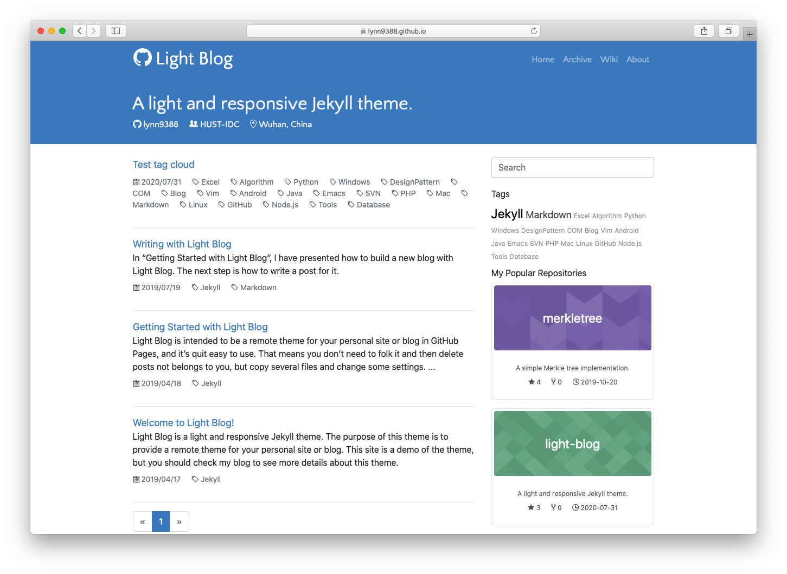

# Light Blog

Light Blog is a light and responsive Jekyll theme, and it's easy to be used as a [remote theme](https://github.blog/2017-11-29-use-any-theme-with-github-pages/).

Github Pages' remote theme is kind like a [gem-based theme](https://jekyllrb.com/docs/themes/#understanding-gem-based-themes). The user doesn't need to worry about the theme files (like HTML, CSS, etc.), but focus on the posts. When the theme is separated with your content, it's easier to deployed and update your site.

> With gem-based themes, some of the site’s directories (such as the `assets`, `_layouts`, `_includes`, and `_sass` directories) are stored in the theme’s gem, hidden from your immediate view. Yet all of the necessary directories will be read and processed during Jekyll’s build process.

## Usage

Check out the [post](https://lynn9388.github.io/light-blog/2019/04/18/getting-started-with-light-blog.html) for more info on how to use this theme in your site.

## Acknowledge

The theme's design is based on [Zhuang Ma's blog](https://github.com/mzlogin/mzlogin.github.io), which is modified from [Yummy-Jekyll](https://github.com/DONGChuan/Yummy-Jekyll). Thank you!

## License

The theme is available as open source under the terms of the [MIT License](https://opensource.org/licenses/MIT).
